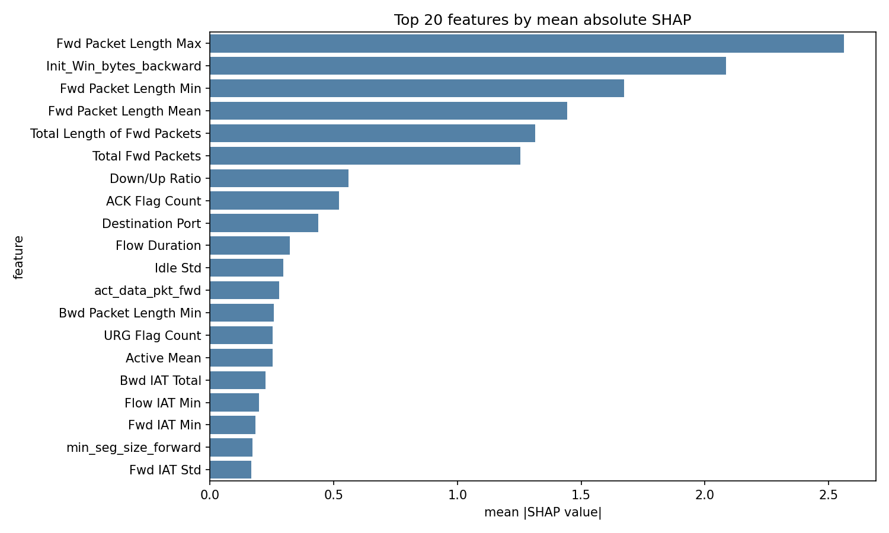
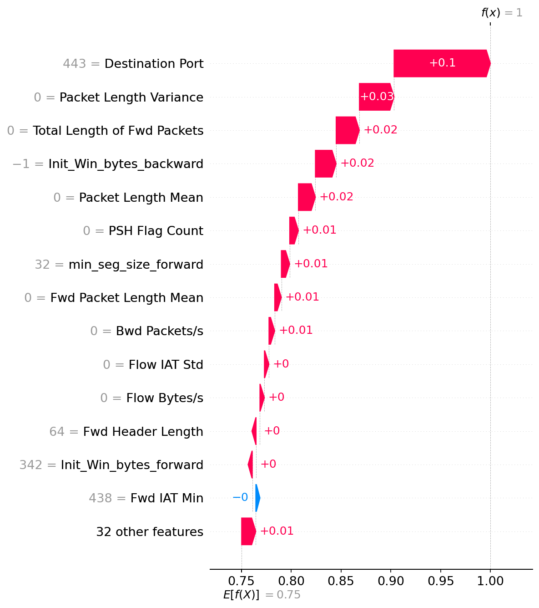

# Explainable AI for Intrusion Detection

A research-focused intrusion detection project that combines machine learning with explainability to identify malicious network traffic while making model decisions understandable to human analysts.

This repository uses the CIC-IDS2017 dataset and evaluates multiple classifiers to detect cyber threats, with a focus on both predictive performance and interpretability using SHAP and LIME.

## Features

- Intrusion detection using machine learning on CIC-IDS2017 network traffic data
- Comparison of multiple classifiers: Logistic Regression, Extra Trees, XGBoost, and LightGBM
- Data preprocessing and feature engineering pipeline for cyber traffic analysis
- Model evaluation using balanced accuracy and macro F1 metrics
- Explainability through SHAP and LIME for both global and local interpretation
- Visual reports for feature importance and sample-level decisions

## Project Description

This project develops an explainable intrusion detection system for network traffic classification using machine learning techniques. It aims to detect a variety of cyberattacks, including DDoS, PortScan, Bot activity, and DoS-based attacks, while also helping security analysts understand why a given traffic flow was classified as malicious or benign.

The system follows a complete workflow from data preprocessing to model training, evaluation, and interpretability analysis. It compares several widely used classifiers and selects the best-performing model using standard evaluation metrics. In addition, SHAP and LIME are applied to provide both global and instance-level explanations, making the model more transparent and suitable for real-world cybersecurity decision-making.

## Why this project matters

Modern intrusion detection systems need to do more than classify traffic correctly. They must also explain why a flow was flagged, which features contributed to the decision, and which traffic patterns resemble known attacks. This project addresses that need by combining:

- robust preprocessing and feature engineering
- multiple model comparisons
- strong evaluation metrics
- explainability tools for model interpretation

## Project goal

To build and evaluate an explainable intrusion detection pipeline that can:

- detect malicious traffic reliably
- highlight the most important network features contributing to the decision
- support security analysis with interpretable visual explanations

## Models used

The project compares the following models:

- Logistic Regression
- Extra Trees Classifier
- XGBoost
- LightGBM

The best-performing model selected by the pipeline is XGBoost.

## Results snapshot

The model outputs under `outputs/reports/modeling outputs/` show strong detection performance.

| Metric | Value |
| --- | ---: |
| Cross-validation macro F1 (mean) | 0.9425 |
| Cross-validation balanced accuracy (mean) | 0.9342 |
| Test balanced accuracy | 0.9672 |
| Test macro F1 | 0.9763 |

These metrics indicate that the selected model is highly effective for distinguishing malicious traffic from benign traffic on the CIC-IDS2017 dataset.

## Explainability results

The project generates both local and global explanations to help interpret model decisions.

### SHAP analysis

SHAP values are used to quantify global feature importance across the dataset. The most influential features include:

- Fwd Packet Length Max
- Init_Win_bytes_backward
- Fwd Packet Length Min
- Fwd Packet Length Mean
- Total Length of Fwd Packets

Global SHAP plot:



Example local SHAP waterfall explanations:



### LIME analysis

LIME generates instance-level explanations for specific network samples. These are stored as HTML reports:

- [LIME sample 1](outputs/reports/explainability/lime_sample_0.html)
- [LIME sample 2](outputs/reports/explainability/lime_sample_46666.html)
- [LIME sample 3](outputs/reports/explainability/lime_sample_93333.html)

Combined summary report:

- [Explainability report](outputs/reports/explainability/explainability_report.html)

## Repository structure

```text
.
├── preprocessing.py
├── model.py
├── explainability.py
├── Dataset_download.md
├── README.md
├── requirements.txt
├── preprocessed_cicids2017_nozerocols.csv    # generated after preprocessing
├── scaler_cicids2017.pkl                    # saved scaler used for preprocessing
├── outputs/
│   └── reports/
│       ├── explainability/
│       └── modeling outputs/
└── .gitignore
```

## Data pipeline

The workflow includes:

- loading the CIC-IDS2017 dataset
- handling infinite and missing values
- removing duplicate records
- cleaning feature names
- encoding labels
- removing zero-variance and highly correlated features
- splitting into train/test sets
- training multiple models
- selecting the best-performing model
- generating SHAP and LIME explanations

## Setup

### 1. Clone the repository

```bash
git clone <repo-url>
cd Explainable-AI-Driven-Machine-Learning-Approaches-for-Intrusion-Detection-
```

### 2. Create a virtual environment

```bash
python -m venv .venv
source .venv/bin/activate
```

### 3. Install dependencies

```bash
pip install -r requirements.txt
```

### 4. Prepare the dataset

Place the processed CIC-IDS2017 CSV at the project root as:

```bash
preprocessed_cicids2017_nozerocols.csv
```

You can download the source dataset using the instructions in `Dataset_download.md`.

## Run the pipeline

```bash
python preprocessing.py
python model.py
python explainability.py
```

This will generate:

- processed data files
- trained models
- evaluation metrics
- confusion matrix plots
- SHAP plots and CSV summaries
- LIME HTML explanation files

## Notes

- This project is structured as a reproducible research prototype for intrusion detection and explainable AI.
- The scripts are designed to run from the repository root without needing hardcoded local paths.
- Outputs are saved under `outputs/` to keep the repository organized and easy to review.

## Project status

The repository is functionally complete as a machine-learning and explainability pipeline for intrusion detection, with generated results and interpretability artifacts included. It is suitable for academic use, experimentation, and presentation in a portfolio or research setting.

## License

This project is intended for academic and research use. If a project-specific license is added later, it should be reviewed and applied accordingly.

